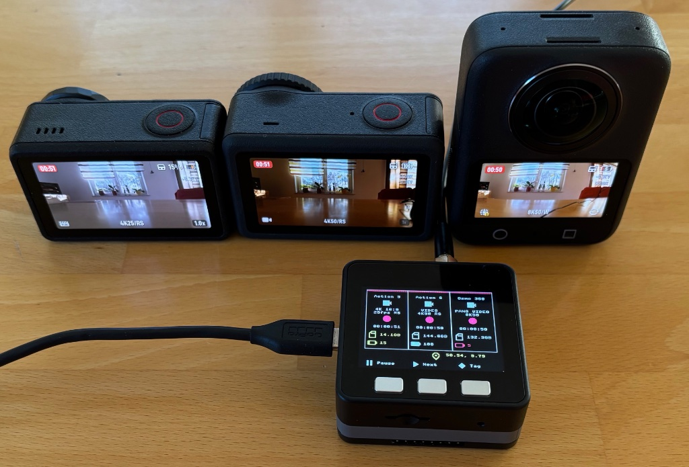

# DJI-Remote – Multi-Camera Remote Control for DJI Osmo Action Cameras  
### Powered by M5Stack Basic V2.7 + Module GPS V2.0 (ESP32)

  




This project provides a fully featured Bluetooth remote controller for managing up to  
**three DJI Osmo Action cameras simultaneously**, including forwarding live GPS data to all connected cameras.

The remote was created out of my own need for a reliable and distraction-free way to control my multicam motovlog setup while riding — with full control and real-time status information at a glance.

[**More info here**](https://www.rhoenschrat.de/dji-remote/index-en.html)  
[**Demo on YouTube**](https://youtu.be/j2qDq6D7IwU)

It is based on:

- [**M5Stack Basic V2.7**](https://docs.m5stack.com/en/core/basic_v2.7)  
- [**M5Stack Module GPS v2.0**](https://docs.m5stack.com/en/module/Module%20GPS%20v2.0)  
- **ESP-IDF (ESP32)**

Features include:

- Start/Stop recording  
- Highlight tag insertion  
- Sleep/Wake control  
- Snapshot while sleeping  
- Mode switching (QS button emulation)  
- Automatic boot-time scanning & reconnection  
- Multi-camera action coordination  
- Live GPS injection to all connected cameras  
- Flicker-free UI with partial redraws  
- **Optional external buttons (GPIO)**


# 📸 Supported Cameras

| Camera Model | Notes |
|--------------|-------|
| DJI Action 4 |  |
| DJI Action 5 Pro |  |
| DJI Action 6 |  |
| Osmo 360 | No highlight tags |


# 🔗 Origin and Credits

This project is based on and inspired by the earlier:

[**M5StickCPlus2_Remote_For_DJI_Osmo**](https://serialhobbyism.com/open-source-diy-remote-for-dji-osmo-action-5-pro-cameras)

Which is based on:
[**Osmo-GPS-Controller-Demo**](https://github.com/dji-sdk/Osmo-GPS-Controller-Demo) by DJI

DJI-Remote significantly extends the concept with:

- Switch to **M5Stack Basic V2.7**  
- A redesigned, larger UI  
- GPS integration  
- Multi-camera logic  
- Wake/snapshot queue processing  


# 🧭 Documentation

| File | Purpose |
|------|---------|
| [`manual.md`](docs/manual.md) | **User Manual** – How to operate the remote |
| [`implementation.md`](docs/implementation.md) | **Developer Documentation** – Firmware architecture & internals |
| [`THIRD_PARTY_NOTICES.md`](THIRD_PARY_NOTICES.md) | Licenses for DJI, ESP-IDF, external code |
| [`LICENSE`](LICENSE) | MIT license for this project |


# 🧱 Hardware Requirements

- [**M5Stack Basic V2.7**](https://docs.m5stack.com/en/core/basic_v2.7)  
- [**M5Stack Module GPS v2.0**](https://docs.m5stack.com/en/module/Module%20GPS%20v2.0)
- USB‑C cable  
- *(Optional)* External hardware buttons using GPIO26 / GPIO21 / GPIO22  


# 🔌 External Buttons (Optional Feature)

The firmware supports **three optional external buttons**, behaving exactly like internal Buttons A, B, and C.

## 📍 External Button Pin Mapping

| Function | GPIO Pin | Electrical Requirements |
|----------|----------|--------------------------|
| External Button A (Shutter) | **GPIO26** | Internal pull‑up enabled |
| External Button B (Next / Navigation) | **GPIO21** | **External 10k pull‑up required** |
| External Button C (Options / Highlight / Sleep/Wake) | **GPIO22** | **External 10k pull‑up required** |


## ⚡ Wiring Instructions

```
External Button A (GPIO26)
--------------------------
GPIO26 ----[ internal pull‑up ]----> 3.3V
   |
  [Button]
   |
  GND


External Button B (GPIO21) – requires external 10k pull‑up
----------------------------------------------------------
         +3.3V
           |
         [10k]
           |
GPIO21 ----+---------[Button]---------> GND


External Button C (GPIO22) – requires external 10k pull‑up
----------------------------------------------------------
         +3.3V
           |
         [10k]
           |
GPIO22 ----+---------[Button]---------> GND
```


## ⚙ Enabling / Disabling External Button Support

External buttons are controlled at build-time via:

```
UI_ENABLE_EXTERNAL_BUTTONS
```

Located in `main/ui.c`.

### Enabled (default)

- GPIO26 / GPIO21 / GPIO22 configured as inputs with interrupts  
- External and internal buttons work in parallel

### Disabled

- External buttons are ignored  
- Only the internal M5Stack buttons remain active


# 🛠 Building the Firmware (ESP‑IDF)

## 1. Install ESP‑IDF
Follow the official guide:  
https://docs.espressif.com/projects/esp-idf/en/latest/esp32/

Export environment:

```bash
. $HOME/esp/esp-idf/export.sh
```


## 2. Prepare the Build

### Clean previous builds:
```bash
idf.py fullclean
```

### Set target for M5Stack Basic V2.7:
```bash
idf.py set-target esp32
```

### Use correct default config:
```bash
cp sdkconfig.defaults.m5stack_basic_v27 sdkconfig.defaults
```

(Optional):
```bash
idf.py menuconfig
```


## 3. Build

```bash
idf.py build
```


## 4. Flash

Linux/macOS:
```bash
idf.py -p /dev/ttyUSB0 flash monitor
```

Windows:
```cmd
idf.py -p COM3 flash monitor
```


# ⭐ Highlight Features

- Complete multi‑camera support  
- Snapshot‑while‑sleeping  
- Highlight tag synchronization  
- Automatic GPS forwarding  
- Accurate status monitoring (1D02 / 1D06)  
- Robust wake/retry logic  
- Smart autoconnect boot behavior  


# 📝 License

This project is licensed under the **MIT License**.  
See [`LICENSE`](LICENSE).

Third‑party licenses (DJI, ESP‑IDF, MIT legacy) are listed in:

👉 [`THIRD_PARTY_NOTICES.md`](THIRD_PARTY_NOTICES.md)


# 🙌 Acknowledgements

Thanks to:

- The creator of the [**M5StickCPlus2_Remote_For_DJI_Osmo**](https://github.com/theserialhobbyist/M5StickCPlus2_Remote_For_DJI_Osmo) project  
- DJI for the [**Osmo-GPS-Controller-Demo**](https://github.com/dji-sdk/Osmo-GPS-Controller-Demo)
- Espressif for ESP‑IDF  
- The open‑source community


# 📬 Feedback

Issues and feature requests are welcome on GitHub.
