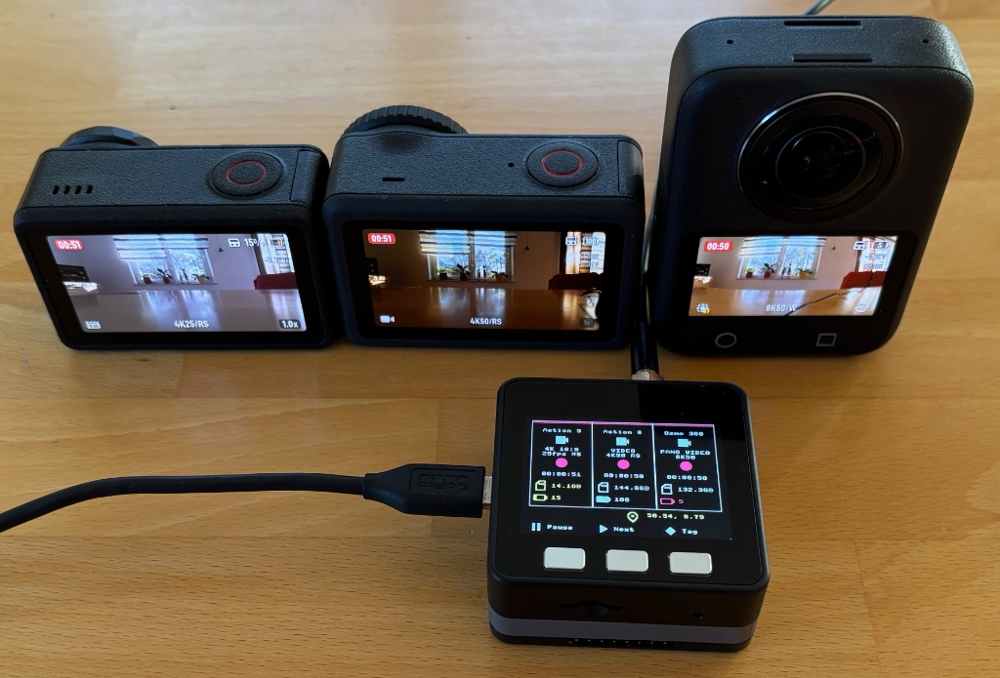

# DJI-Remote – Multi-Camera Remote Control for DJI Osmo Action Cameras
### Powered by M5Stack Basic V2.7 (ESP32) and Waveshare ESP32-S3-LCD-1.9 (ESP32-S3)

   




This project provides a fully featured Bluetooth remote controller for managing up to
**three DJI Osmo Action cameras simultaneously**, including forwarding live GPS data to all connected cameras.

The remote was created out of my own need for a reliable and distraction-free way to control my multicam motovlog setup while riding — with full control and real-time status information at a glance.

[**More info here**](https://www.rhoenschrat.de/dji-remote/index-en.html)
[**Demo on YouTube**](https://youtu.be/j2qDq6D7IwU)

It is based on:

- [**M5Stack Basic V2.7**](https://docs.m5stack.com/en/core/basic_v2.7)
- [**M5Stack Module GPS v2.0**](https://docs.m5stack.com/en/module/Module%20GPS%20v2.0)
- [**Waveshare ESP32-S3-LCD-1.9**](https://www.waveshare.com/esp32-s3-lcd-1.9.htm)
- **ESP-IDF (ESP32 / ESP32-S3)**
- **LVGL 9.5.0** (UI rendering via esp_lvgl_port)

Features include:

- Start/Stop recording
- Highlight tag insertion
- Sleep/Wake control
- Snapshot while sleeping
- Mode switching (QS button emulation)
- Automatic boot-time scanning & reconnection
- Multi-camera action coordination
- Live GPS injection to all connected cameras
- LVGL-based UI with hardware-accelerated rendering
- **Optional external buttons (GPIO)**


# Supported Cameras

| Camera Model | Notes |
|--------------|-------|
| DJI Action 4 |  |
| DJI Action 5 Pro |  |
| DJI Action 6 |  |
| Osmo 360 | No highlight tags |


# Origin and Credits

This project is based on and inspired by the earlier:

[**M5StickCPlus2_Remote_For_DJI_Osmo**](https://serialhobbyism.com/open-source-diy-remote-for-dji-osmo-action-5-pro-cameras)

Which is based on:
[**Osmo-GPS-Controller-Demo**](https://github.com/dji-sdk/Osmo-GPS-Controller-Demo) by DJI

DJI-Remote significantly extends the concept with:

- Switch to **M5Stack Basic V2.7**
- A redesigned, larger UI
- GPS integration
- Multi-camera logic
- Wake/snapshot queue processing


# Documentation

| File | Purpose |
|------|---------|
| [`docs/manual.md`](docs/manual.md) | **User Manual** – How to operate the remote |
| [`docs/implementation.md`](docs/implementation.md) | **Developer Documentation** – Firmware architecture and internals |
| [`docs/hardware-waveshare-s3-lcd19.md`](docs/hardware-waveshare-s3-lcd19.md) | **Hardware Reference** – Waveshare ESP32-S3-LCD-1.9 pin assignments and wiring |
| [`CHANGELOG.md`](CHANGELOG.md) | **Changelog** – Full version history |
| [`THIRD_PARTY_NOTICES.md`](THIRD_PARTY_NOTICES.md) | Licenses for DJI, ESP-IDF, LVGL, NimBLE and other external code |
| [`LICENSE`](LICENSE) | MIT license for this project |


# Hardware Requirements

## M5Stack Basic V2.7

- [**M5Stack Basic V2.7**](https://docs.m5stack.com/en/core/basic_v2.7)
- [**M5Stack Module GPS v2.0**](https://docs.m5stack.com/en/module/Module%20GPS%20v2.0)
- USB-C cable
- *(Optional)* External hardware buttons using GPIO26 / GPIO21 / GPIO22

## Waveshare ESP32-S3-LCD-1.9

- [**Waveshare ESP32-S3-LCD-1.9**](https://www.waveshare.com/esp32-s3-lcd-1.9.htm)
- 3 external momentary push-buttons (GPIO5 / GPIO6 / GPIO16)
- ATGM336H (or compatible) GPS module
- USB-C cable


# External Buttons

## M5Stack Basic V2.7 (Optional)

The firmware supports **three optional external buttons**, behaving exactly like internal Buttons A, B, and C.

### External Button Pin Mapping

| Function | GPIO Pin | Electrical Requirements |
|----------|----------|--------------------------|
| External Button A (Shutter) | **GPIO26** | Internal pull-up enabled |
| External Button B (Next / Navigation) | **GPIO21** | **External 10k pull-up required** |
| External Button C (Options / Highlight / Sleep/Wake) | **GPIO22** | **External 10k pull-up required** |

### Wiring Instructions

```
External Button A (GPIO26)
--------------------------
GPIO26 ----[ internal pull-up ]----> 3.3V
   |
  [Button]
   |
  GND


External Button B (GPIO21) – requires external 10k pull-up
----------------------------------------------------------
         +3.3V
           |
         [10k]
           |
GPIO21 ----+---------[Button]---------> GND


External Button C (GPIO22) – requires external 10k pull-up
----------------------------------------------------------
         +3.3V
           |
         [10k]
           |
GPIO22 ----+---------[Button]---------> GND
```

### Enabling / Disabling External Button Support

External buttons are controlled at build-time via:

```
UI_ENABLE_EXTERNAL_BUTTONS
```

Located in `main/ui.c`.

**Enabled (default):**
- GPIO26 / GPIO21 / GPIO22 configured as inputs with interrupts
- External and internal buttons work in parallel

**Disabled:**
- External buttons are ignored
- Only the internal M5Stack buttons remain active

## Waveshare ESP32-S3-LCD-1.9 (Required)

The Waveshare board has no built-in user buttons. Three external momentary
push-buttons are required and connect directly between the GPIO pin and GND.
Internal pull-ups are enabled — no external resistors needed.

| Function | GPIO Pin | Electrical Requirements |
|----------|----------|--------------------------|
| Button A (Shutter) | **GPIO5** | Internal pull-up enabled |
| Button B (Next / Navigation) | **GPIO6** | Internal pull-up enabled |
| Button C (Options / Highlight / Sleep/Wake) | **GPIO16** | Internal pull-up enabled |

See [`docs/hardware-waveshare-s3-lcd19.md`](docs/hardware-waveshare-s3-lcd19.md)
for the full wiring diagram and GPS module connection.


# Building the Firmware (ESP-IDF)

## 1. Install ESP-IDF

Follow the official guide:
https://docs.espressif.com/projects/esp-idf/en/latest/esp32/

Export environment:

```bash
. $HOME/esp/esp-idf/export.sh
```

## 2. Build for M5Stack Basic V2.7 (ESP32)

```bash
idf.py fullclean
idf.py set-target esp32
cp sdkconfig.defaults.m5stack_basic_v27 sdkconfig.defaults
idf.py build
```

## 3. Build for Waveshare ESP32-S3-LCD-1.9 (ESP32-S3)

```bash
idf.py fullclean
idf.py set-target esp32s3
cp sdkconfig.defaults.waveshare_s3_lcd19 sdkconfig.defaults
idf.py build
```

## 4. Flash

Linux/macOS:
```bash
idf.py -p /dev/ttyUSB0 flash monitor
```

Windows:
```cmd
idf.py -p COM3 flash monitor
```


# Web Flash (Easiest)

Both targets are flashed via [espflash.app](https://espflash.app)
(Chrome or Edge required). Download the correct binary for your hardware from
the [latest release](https://github.com/rhoenschrat/DJI-Remote/releases/latest):

- `dji-remote-v1.2.0-m5stack-basic-v27.bin` — for M5Stack Basic V2.7
- `dji-remote-v1.2.0-waveshare-s3-lcd19.bin` — for Waveshare ESP32-S3-LCD-1.9

Select the port, load the `.bin` file, and flash — no toolchain required.


# Highlight Features

- Complete multi-camera support
- Snapshot-while-sleeping
- Highlight tag synchronization
- Automatic GPS forwarding
- Accurate status monitoring (1D02 / 1D06)
- Robust wake/retry logic
- Smart autoconnect boot behavior


# License

This project is licensed under the **MIT License**.
See [`LICENSE`](LICENSE).

Third-party licenses (DJI, ESP-IDF, MIT legacy) are listed in:

[`THIRD_PARTY_NOTICES.md`](THIRD_PARTY_NOTICES.md)


# Acknowledgements

Thanks to:

- The creator of the [**M5StickCPlus2_Remote_For_DJI_Osmo**](https://github.com/theserialhobbyist/M5StickCPlus2_Remote_For_DJI_Osmo) project
- DJI for the [**Osmo-GPS-Controller-Demo**](https://github.com/dji-sdk/Osmo-GPS-Controller-Demo)
- Espressif for ESP-IDF
- The open-source community


# Feedback

Issues and feature requests are welcome on GitHub.

<a href="https://www.buymeacoffee.com/rhoenschrat" target="_blank"></a>
